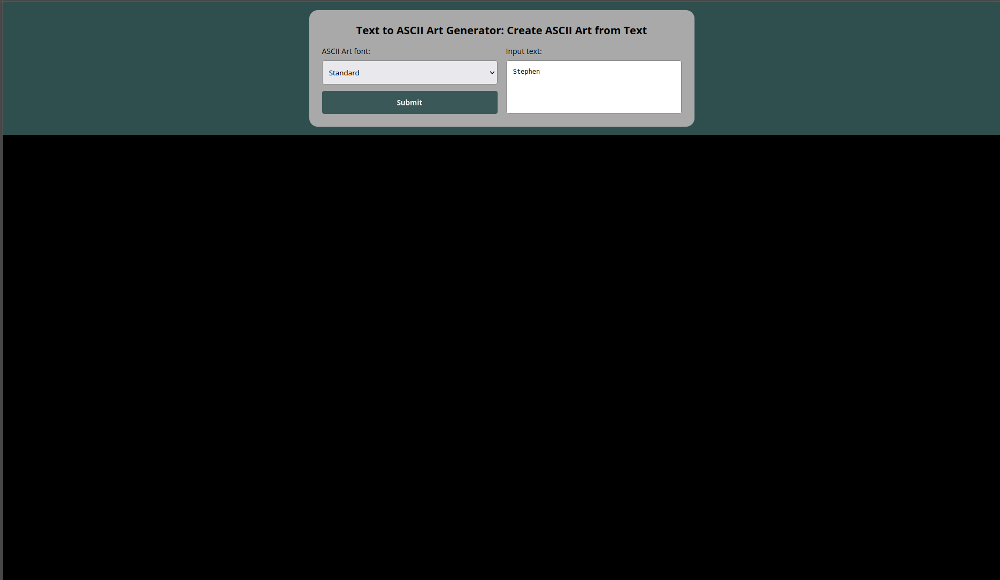

# Goffiti Web Stylize
```
A Go-powered web interface for generating ASCII art.
```

## **Features**
- **Custom Text Input:** Support for multi-line strings and special characters.
- **Banner Selection:** Toggle between `shadow`, `standard`, and `thinkertoy` styles.
- **Web-Based UI:** No command line knowledge required for the end user.

## **Prerequisites**
- **Go** (1.22.2+)
- **Git**
- A modern web browser

2. Access to a Terminal

## Getting Started
1. Clone the repository: 
```bash
git clone https://github.com/stephenworld/Goffiti.git
```
2. Navigate to the web directory: 
```bash
cd goffiti-web
```
3. Change to the stylize branch: 
```bash
git checkout stylize
```
3. Run the application: 
```bash
go run .
```
4. Open your browser and visit: 
```
http://localhost:8080
```

## **Usage**

### 1. Standard Usage
Fill the text input from the GUI



### 2. Specify a Banner
Choose a specific style from the GUI (e.g., shadow, standard, thinkertoy):

## Example Output
Output:


## Contributing
Contributions, issues, and feature requests are welcome!

Feel Free to check the [issues](https://github.com/stephenworld/Goffiti/issues)